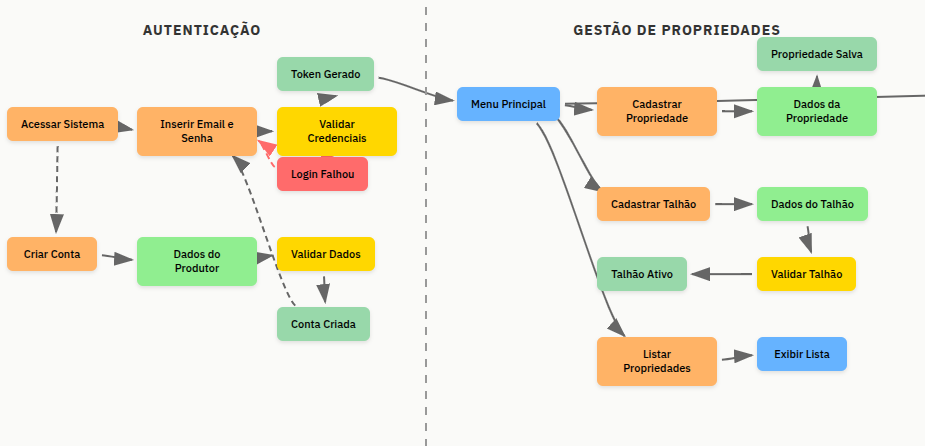
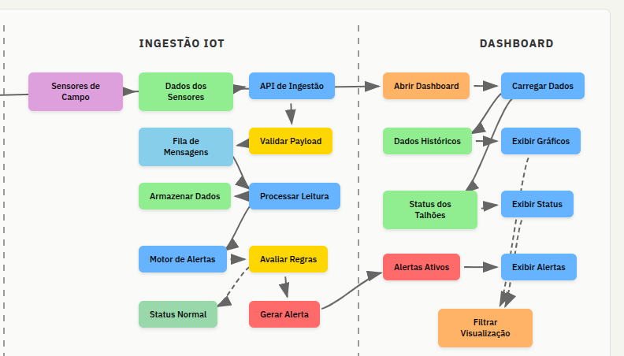

# AgroSolutions — Hackathon (Fase 5)

Plataforma MVP de **Agricultura 4.0** para a cooperativa **AgroSolutions**, com **IoT + análise de dados** para agricultura de precisão.

> Contexto do desafio: modernizar a cooperativa com dados em tempo real para reduzir desperdícios e melhorar produtividade. :contentReference[oaicite:0]{index=0}

---

## 🎯 Objetivo do MVP

Entregar uma solução funcional que atenda aos mínimos do Hackathon:

- **Autenticação do Produtor Rural**
- **Cadastro de Propriedade e Talhões**
- **API de ingestão de dados de sensores (simulada)**
- **Dashboard com histórico e status/alertas por talhão**
- **Motor simples de alertas** (ex.: umidade < 30% por 24h ⇒ “Alerta de Seca”) :contentReference[oaicite:1]{index=1}

Além dos requisitos técnicos obrigatórios: **microsserviços**, **Kubernetes**, **observabilidade (Grafana + Zabbix ou Prometheus)**, **mensageria**, **CI/CD**. :contentReference[oaicite:2]{index=2}

---

## 👥 Participantes

- **Armando José Vieira Dias de Oliveira** — @armandojoseoliveira (Nando) — RM361112  
- **Marlon dos Santos Limeira** — @marlonsantos4509 — RM361866  
- **Matheus Nascimento Costa** — @matheus_coast — RM363404  
- **Ricardo Noronha de Menezes** — @ricardo_nm — RM363183  

---

## 🧩 Arquitetura (Microsserviços)

> Referência do enunciado: exemplo de serviços (Identidade, Propriedades, Ingestão, Análise/Alertas). :contentReference[oaicite:3]{index=3}

### Serviços (visão lógica)
- **Identity Service**
  - Login do produtor (e-mail/senha)
- **Property Service**
  - Cadastro de propriedade
  - Cadastro/delimitação de talhões e cultura por talhão
- **Ingestion API**
  - Recebe leituras simuladas (umidade do solo, temperatura, precipitação) por talhão :contentReference[oaicite:4]{index=4}
  - Publica evento/mensagem para processamento assíncrono
- **Analytics/Alerts Worker**
  - Consome mensagens
  - Persiste série temporal no InfluxDB
  - Aplica regras simples (ex.: seca)
  - Emite “status” do talhão para consumo no dashboard

### Fluxo principal (alto nível)
1. Sensor simulado → **Ingestion API**
2. **Ingestion API** → publica no **RabbitMQ**
3. **Worker** consome → grava no **InfluxDB**
4. **Grafana** consulta InfluxDB (histórico, status, alertas)

---

## 🧱 Stack e Infra

### Kubernetes (local)
- Cluster local com **kind**
- Serviços rodando no cluster:
  - **RabbitMQ** (mensageria)
  - **InfluxDB** (TSDB)
  - **Grafana** (dashboard)

### Banco relacional (fora do cluster)
- **SQL Server** hospedado **fora do Kubernetes**
- Acesso ao SQL Server dentro do cluster via **Service + EndpointSlice**
- EndpointSlice provisionado apontando para o SQL Server levantado com **docker-compose**

### CI/CD
- **GitHub Actions**
- **Runners self-hosted** na máquina do Ricardo
- Pipeline automatizado para build/test/deploy

### Acesso para demonstração
- Demonstração das APIs via **kubectl port-forward** para os serviços no cluster

---

## 🧠 Justificativa técnica — Por que InfluxDB?

A transição para agricultura baseada em dados exige infraestrutura para **alta densidade de telemetria**. Bancos relacionais tradicionais têm custo desproporcional ao lidar com ingestão contínua, volume e dados fortemente temporais.

**InfluxDB** foi escolhido por ser uma **Time Series Database (TSDB)** otimizada para armazenamento e análise indexados pelo tempo, oferecendo:

- **Arquitetura TSM + TSI**
  - Alta compressão e menor footprint (TSM)
  - Índice eficiente mesmo com alta cardinalidade (TSI)
- **Retenção e downsampling**
  - Mantém alta resolução no curto prazo e agrega/expira histórico conforme estratégia
- **Ingestão em tempo real + baixa latência**
  - Base para alertas críticos (ex.: variação atípica de umidade)
- **Flux**
  - Agregações e cálculos no banco, reduzindo carga em serviços .NET
- **Integração nativa com Grafana**
  - Dashboards dinâmicos traduzindo telemetria em indicadores acionáveis
- **Cloud-native**
  - Boa aderência ao Kubernetes e escalabilidade horizontal

---

## ✅ Requisitos atendidos (checklist)

### Funcionais
- [x] Login do Produtor (e-mail/senha) :contentReference[oaicite:5]{index=5}  
- [x] Cadastro de Propriedade e Talhões (com cultura por talhão) :contentReference[oaicite:6]{index=6}  
- [x] API de ingestão de sensores simulados (umidade/temperatura/precipitação) :contentReference[oaicite:7]{index=7}  
- [x] Dashboard com histórico + status geral do talhão :contentReference[oaicite:8]{index=8}  
- [x] Motor de alertas simples (exemplo: umidade < 30% por 24h) :contentReference[oaicite:9]{index=9}  

### Técnicos obrigatórios
- [x] Microsserviços :contentReference[oaicite:10]{index=10}  
- [x] Kubernetes (kind local) :contentReference[oaicite:11]{index=11}  
- [x] Observabilidade (Grafana + Zabbix ou Prometheus) :contentReference[oaicite:12]{index=12}  
- [x] Mensageria (RabbitMQ) :contentReference[oaicite:13]{index=13}  
- [x] CI/CD (GitHub Actions) :contentReference[oaicite:14]{index=14}  

---

## ▶️ Como rodar localmente (visão geral)

> **Pré-requisitos**
- Docker + Docker Compose
- kubectl
- kind
- (opcional) helm

### 1) Subir o SQL Server fora do cluster (docker-compose)
```bash
# exemplo
docker compose up -d

### 1) Subir o SQL Server fora do cluster (docker-compose)
```bash
# Diagramas de Arquitetura



